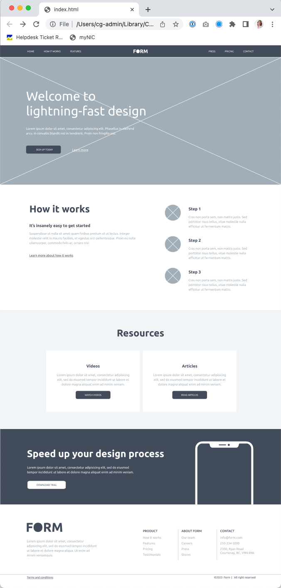
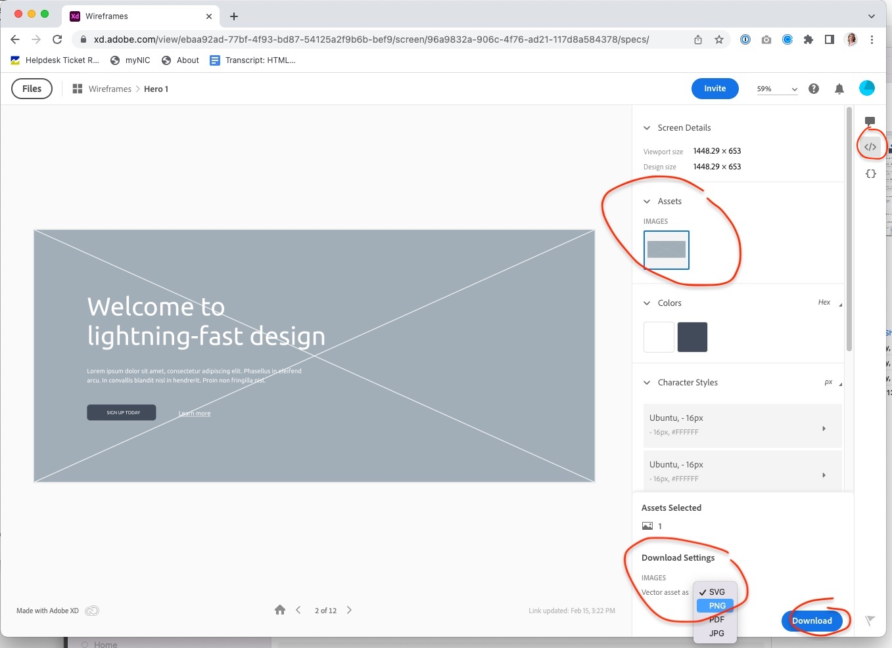

# Flexbox

## Objectives
You will code a webpage made up of a series of different content blocks that you can choose from some provided layouts. You will use flexbox and the CSS box model to organize the content on the page and fine-tune the layouts of the different blocks. This exercise also provides the opportunity to practice coding using an Adobe XD wireframe as a visual and CSS reference.

## Instructions
Remember to:
* Regularly save your files and check out what your web page looks like in a web browser.
* Make regular commits and pushes. **Your instructor will be looking at how you wrote your commit messages!**
### 1. Get set up
* Clone your remote exercise repository onto your local machine.
* Add a comment in the head element of the homepage including: the course code and your section number - your name - Exercise 6. Example:
```
<!-- DGL 103 CVS1 - your name - Flexbox -->
```
### 2. Choose your content block layouts
You can choose your content blocks by visiting this site: https://xd.adobe.com/view/880fa750-7ec7-44cc-94f7-e8a7d5281509-dd5c/flow.
There are two layouts for each of the six provided content blocks. You must choose one layout from each content block and use the provided high fidelity wireframes as a guide to code the HTML and CSS for a webpage that has the following structure:
1. Header
2. Hero
3. How it works
4. Resources
5. Call-to-action
6. Footer

### 3. Code the content blocks
1. In VS Code, create two new files called index.html and style.css. Link your external stylesheet to your HTML file. 
2. Code each one of your chosen content blocks. Some CSS is available for you to copy in the XD link (see below for instructions on how to view the CSS). The content blocks must be coded from scratch using flexbox (not allowed to use display inline/inline-block, floats, positioning, bootstrap or any other layout techniques that we have or haven't learnt yet). The content blocks should be centered on the page with negative horizontal space on either side, the width of the content is 1170px. The content blocks must look just like the wireframes when finished.

Depending on which content blocks you choose, your finished webpage could look like this for example:


#### Tips for using the XD wireframes link:
1. Click on a content block layout to view its details. 
2. Click on the Development icon </> in the vertical bar on the right of the screen to view the CSS for the colours and typography that were applied to the content. The font "Ubuntu" is available from Google Fonts. 
3. If you select a chunk of text in the layout, the content will appear in the panel on the right, as text that you can copy and paste directly into your HTML.
4. A medium-grey area of space with an X across it is the wireframe language for an image. If images are included in the layout of a content block then you can download the image by clicking on it in the Assets panel on the right > select the PNG file format from the dropdown under Download Settings > click the Download button.


### 4. Format, organize and add comments 
* Use the Prettier VSCode extension to format HTMl and CSS code.
* Add organizational CSS comments and order your style rules so that your CSS is easy to read.
* Add a few comments to explain your HTML and CSS code and highlight anything of interest.

### 5. Check for errors
* Use the VSCode HTMLHint extension and validate your HTML code to make sure that it is correct: https://validator.w3.org/#validate_by_upload. Take a screenshot of the results.
* Validate your CSS code to make sure that it is correct: https://jigsaw.w3.org/css-validator/ for CSS. Take a screenshot of the results.

**You have now completed your exercise but you still need to push your edits to GitHub and submit it in Brightspace. Make sure to follow the instructions in the How to Complete Your Exercises Guide.** 