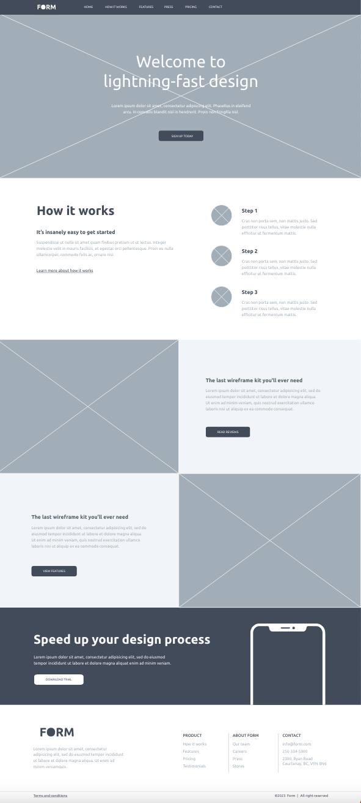

# Week 8 Exercise

## Objectives
You will code a webpage made up of a series of different content blocks that you can chose from some provided layouts. You will use flexbox and the CSS box model to organize the content on the page and fine-tune the layouts of the different blocks. This exercise also provides the opportunity to practice coding using an Adobe XD wireframe as reference.

## Instructions
Remember to:
* Regularly save your files and check out what your web page looks like in a web browser.
* Make regular commits and pushes. **Your instructor will be looking at how you wrote your commit messages!**
### Get set up
* Clone your remote exercise repository onto your local machine.
* Add a comment in the head element of the homepage including: the course code and your section number - your name - Exercise 6. Example:
```
<!-- DGL 103 CVS1 - your name - Week 8 Exercise -->
```
### Choose your content block layouts
You will code the HTML and CSS for a webpage that includes the following content blocks:
1. Header
2. Hero
3. How it works
4. Resources
5. Call-to-action
6. Footer

The content blocks have been designed as high fidelity wireframes and each content block includes two possible layouts. You need to chose one layout for each block. To easily view your options, click on the link below then Wireframes > Tree icon:

https://xd.adobe.com/view/ebaa92ad-77bf-4f93-bd87-54125a2f9b6b-bef9/ 


### Code the content blocks
1. In VS Code, create two new files called index.html and style.css. Link your external stylesheet to your HTML file. 
2. Code each one of your chosen content blocks. The layouts must be coded from scratch using flexbox and must look just like the wireframes when finished. **Using Bootstrap is not allowed.** The content blocks should be centered on the page.

Depending on which content blocks you choose, your finished webpage could look like this for example:


#### Tips for using the XD wireframes link
1. Click on a content block layout to view its details. 
2. Click on the Development icon </> in the vertical bar on the right of the screen to view the colours and typography that were applied to the content. The font "Ubuntu" is available from Google Fonts. 
3. If you select a chunk of text in the layout, the content will appear in the panel on the right, as text that you can copy and paste directly into your HTML.
4. A medium-grey area of space with an X across it is the wireframe language for an image. If images are included in the layout of a content block then you can download the image by clicking on it in the Assets panel on the right > select the PNG file format from the dropdown under Download Settings > click the Download button.


### Format, organize and add comments 
* Use the Prettier VSCode extension to format HTMl and CSS code.
* Add organizational CSS comments and order your style rules so that your CSS is easy to read.
* Add a few comments to explain your HTML and CSS code and highlight anything of interest.

### Check for errors
Use the VSCode HTMLHint extension and validate your code to make sure that it is correct (https://validator.w3.org/#validate_by_upload for HTML, https://jigsaw.w3.org/css-validator/ for CSS).

### Submit your work
1. Commit your changes.
2. Push your changes to GitHub. 
3. Submit in Brightspace to the "Unit 3 Exercises" assignment and follow the instructions. 
4. If you have been using a lab computer on campus, remember to restart the computer.

## Deadlines
Assignments must be submitted before the end of the week but they will only be graded at the end of every unit. Late assignments will not be accepted and will receive an F. You can complete and submit a contract that allows you to extend the deadline for an assignment but you must email it to your instructor a minimum of 48 hrs before the deadline. Deadline extensions are only allowed for those unplanned, unexpected emergencies that life sometimes throws at us, and they will only be approved by your instructor if you follow the correct process. See the Course Info folder in BrightSpace for more info.